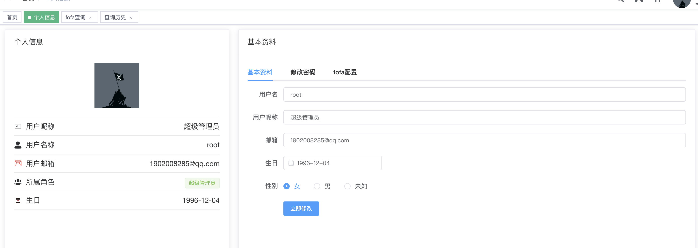

# Myscanner

简体中文 | [English](./README.md)

**一个基于springboot&springsecurity和vueadmin的综合信息收集和漏洞扫描系统**

注意:这是后端和数据库仓库，前端部署请访问https://github.com/retnullyu/myscaner-front

### 主要功能

**项目正在开发中，更多功能敬请期待**